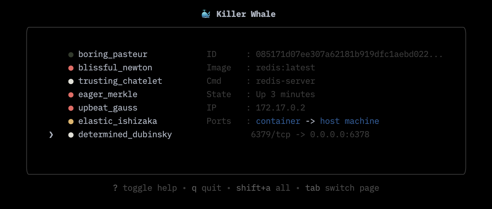

# killer-whale 🐳

Killer Whale is a Docker client that runs in your terminal. It provides an intuitive, easy-to-use interface for managing your Docker containers.

<p align="center">
  
</p>

## Features

1. stop, start, kill, remove, pause, unpause
2. bulk actions on multiple containers
3. inspect containers, images, volumes

Thought its tempting to add more features, `killer-whale` meant to be as **easy to use** & as **minimalistic** as possible.

## Usage

1. Clone the repository using Git:

```bash
git clone https://github.com/somnek/killer-whale.git
```

2. Run the application using Go:

```bash
go run .
```

or build it:

```bash
cd killer-whale && go build -o killer
```

Once the build is complete, move the executable to a directory in your system's `PATH` environment variable so that you can run it from anywhere.

For example, on Linux or macOS, you can move the executable to the `/usr/local/bin` directory:

3. Restart your terminal and run the application:

zsh:

```bash
source ~/.zshrc
```

bash:

```bash
exec bash
```

